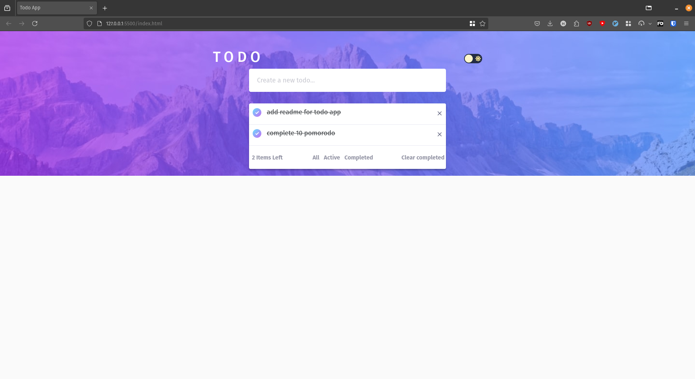

# todo-app

This is a simple todo app built with HTML, SCSS, JS, Bootstrap and CSS. UI is from [frontendmentor](https://www.frontendmentor.io/challenges/todo-app-Su1_KokOW)

### Built with

- HTML5
- SCSS
- JS
- Bootstrap
- CSS

Checkout out the [link](https://harishcalvin.github.io/todo/) and share your feedback

## images

1. Light Mode

2. Dark Mode

3. With todo items in all state

4. With todo items in active state

5. With todo items in completed state

View live app [click here](https://harishcalvin.github.io/todo/)
